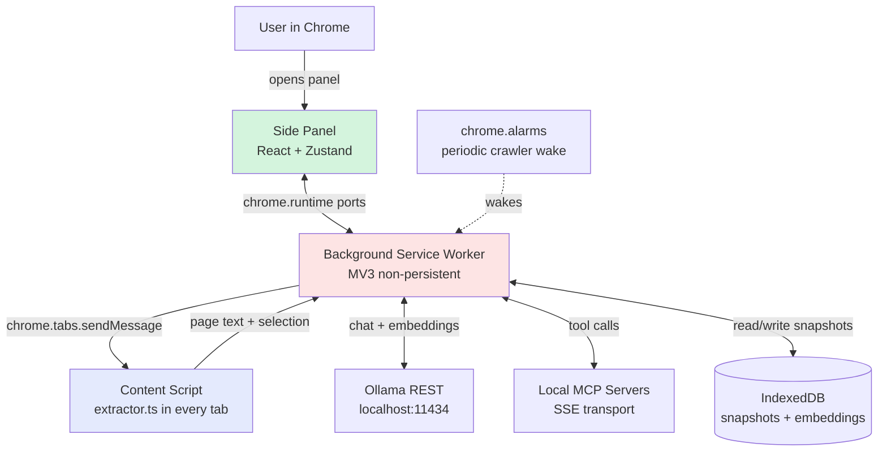

# Architecture

This document is a human-facing summary of how Ollama Sidekick is built. It is
intentionally short — for the full architectural spec, message protocol details, and
per-file responsibilities, see [CLAUDE.md](CLAUDE.md).

## Overview

Ollama Sidekick is a Chrome Manifest V3 extension that gives the user a persistent
side panel for AI-assisted browsing. All inference runs locally through a
user-installed [Ollama](https://ollama.com) instance; no data leaves the machine.
The extension extracts content from the active tab, lets the user chat about it,
crawls and indexes favorited pages into a local semantic store, and optionally
proxies tool calls to local [MCP](https://modelcontextprotocol.io) servers.

## Component Diagram

The three JavaScript contexts (background, content script, side panel) cannot share
memory. They communicate only through Chrome's typed message passing.

## Message Passing

All cross-context communication goes through a discriminated union of message types
defined in [src/types/messages.ts](src/types/messages.ts). This is the source of
truth for the contract — no raw `{ type: "SOME_STRING" }` literals appear anywhere
else in the codebase.

Two channels:

- **One-shot messages** (`chrome.runtime.sendMessage` / `chrome.tabs.sendMessage`)
  for request/response style: "give me page content", "fetch favorites", etc.
- **Long-lived ports** (`chrome.runtime.connect`) for streaming. The chat path uses a
  `chat` port so background-worker token streams from Ollama can push into the side
  panel in real time. Ports survive across multiple postMessage calls; one-shot
  messages do not.

For the full list of message types and the port lifecycle, see CLAUDE.md
"Typed Message Passing" and "Streaming Tokens to the UI".

## Service Worker Lifecycle (Important Gotcha)

The background worker is **non-persistent** under MV3 — Chrome kills it after about
30 seconds of inactivity. Implications:

- No module-level state. Anything that must survive a sleep cycle goes in
  `chrome.storage` or IndexedDB.
- The `chrome.alarms` API wakes a sleeping worker — this is how the crawler runs on a
  schedule.
- SSE connections to MCP servers are dropped when the worker sleeps. We re-establish
  them lazily on demand rather than assuming a persistent stream.

Treat the background worker as a stateless RPC handler that happens to share an
address space across calls when Chrome hasn't yet evicted it.

## Storage Layer

IndexedDB via the `idb` library. Snapshots (URL, extracted text, chunks, embedding
vectors, timestamps) are persisted across browser restarts. See
[src/lib/storage/](src/lib/storage/) for the schema and CRUD layer. The default
single-store schema lives in `src/lib/storage/db.ts`; favorites and snapshots have
dedicated modules.

Quota is the main operational concern — see the
[storage quota brainstorm seed](docs/brainstorms/storage-quota-management-seed.md)
for the open work.

## External Integrations

| Integration | Transport | Notes |
|-------------|-----------|-------|
| Ollama | HTTP REST on `localhost:11434` | Requires `OLLAMA_ORIGINS=chrome-extension://*` to allow cross-origin requests from the extension |
| MCP servers | HTTP + SSE on `localhost:<port>` | Browser extensions cannot use stdio transport; servers must expose HTTP/SSE. See [native messaging host brainstorm](docs/brainstorms/native-messaging-host-seed.md) for the gap. |

Both are user-installed on the same machine; the extension never reaches off-host.

## Crawler and Semantic Search

The crawler runs on a `chrome.alarms` schedule (default: hourly). For each favorited
URL it fetches the page, parses the readable text, chunks it (~500 chars with
overlap), generates an embedding for each chunk via Ollama's `nomic-embed-text`
model, and persists to IndexedDB.

At search time the user's query is embedded the same way; cosine similarity is
computed brute-force across all stored chunks; top-K results above a similarity
threshold are returned. For Chat with RAG, those chunks are injected into the Ollama
chat context as a system-prompt prefix.

## Where to Look Next

- [CLAUDE.md](CLAUDE.md) — full architecture spec, message types, Chrome Web Store
  policy notes, and detailed file-by-file responsibilities
- [CONTRIBUTING.md](CONTRIBUTING.md) — dev environment setup, code conventions, PR
  process, and an open-docs backlog
- [STRATEGY.md](STRATEGY.md) — product strategy, active and candidate tracks
- [AGENTS.md](AGENTS.md) — Compound Engineering workflow conventions for AI agents
  working in this repo
- [docs/brainstorms/](docs/brainstorms/) — seed topics for the next features
