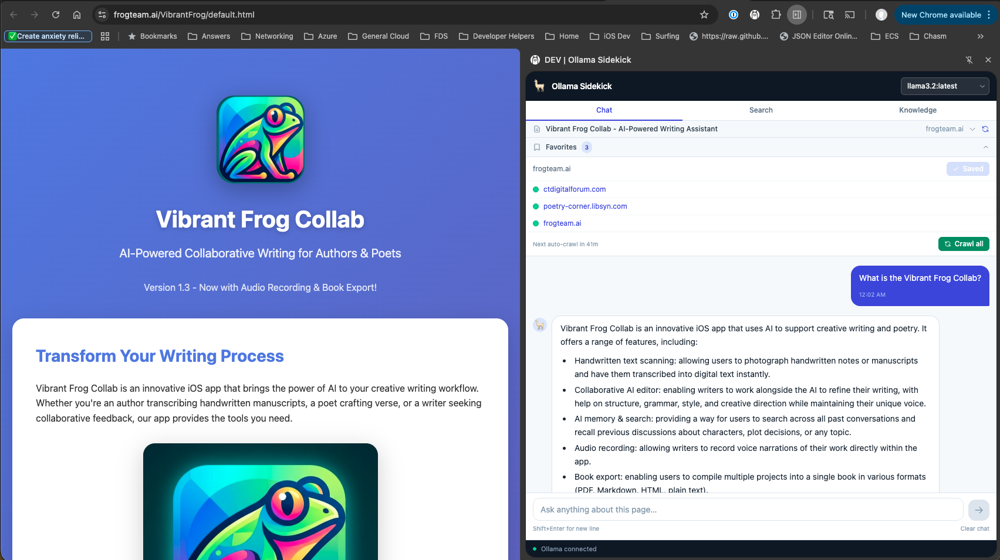

# LocalMind by Interra

A privacy-first AI assistant that lives in your browser's side panel. All inference runs locally through [Ollama](https://ollama.com) — no data leaves your machine, no accounts, no subscriptions.



---

## What it does

**Chat** — Ask questions about the page you're reading. LocalMind by Interra automatically picks up the current page's text and uses it as context, so you can ask things like "summarize this article", "what are the key arguments here?", or "find the pricing information on this page."

**Search your saved pages** — Mark pages as favorites and the extension crawls them on a schedule, building a local semantic index. The Search tab lets you find relevant content across everything you've saved using natural-language queries, not just keyword matching.

**Knowledge base** — Browse all your crawled pages in one place, with auto-generated summaries and the ability to drill into page sections.

**MCP tool calling** — If you run local [MCP](https://modelcontextprotocol.io) servers, LocalMind by Interra can discover their tools and let the AI use them during chat.

---

## Requirements

- **macOS, Linux, or Windows** with Chrome 114+
- **[Ollama](https://ollama.com)** installed and running locally
- Two Ollama models pulled (one-time setup):
  - A chat model: `llama3.2`, `qwen2.5-coder`, `mistral-nemo`, or any model you prefer
  - An embedding model: `nomic-embed-text` (used for semantic search)

---

## Setup

### 1. Install Ollama and pull models

```bash
# Pull a chat model (pick one you like)
ollama pull llama3.2

# Pull the embedding model (required for search)
ollama pull nomic-embed-text
```

### 2. Start Ollama with browser CORS enabled

Chrome extensions are a different origin than `localhost`. Ollama blocks cross-origin requests by default, so you must allow the extension's origin when starting Ollama.

**During development** (unpacked extension), use the wildcard — your local extension ID changes if the folder moves or on a different machine:

```bash
OLLAMA_ORIGINS="chrome-extension://*" ollama serve
```

**After installing from the Chrome Web Store**, the extension ID is permanent and the same for every user. Lock it down to that specific ID for better security. The exact command is shown in the extension's **Options page** (right-click the toolbar icon → Options) with a one-click copy button.

> If Ollama is already running, stop it first (`Ctrl+C` or `pkill ollama`) then restart with the command above.

### 3. Install the extension

**Option A — Chrome Web Store** *(coming soon)*

**Option B — Load manually (developer mode)**

1. Download or clone this repository
2. Install dependencies and build:
   ```bash
   npm install
   npm run build
   ```
3. Open Chrome and go to `chrome://extensions`
4. Turn on **Developer mode** (toggle in the top-right corner)
5. Click **Load unpacked** and select the `build/chrome-mv3-prod` folder

### 4. Open the side panel

Click the LocalMind by Interra icon in your Chrome toolbar. The side panel opens on the right side of your browser window and stays open as you browse.

---

## Using the extension

### Chat tab

Type a question and press Enter. The assistant automatically includes the current page's text as context. If you highlight text on the page before asking, that selection is used as the primary context.

- **Model selector** (top-right of the header) — switch between any chat models you have installed in Ollama. Your choice is remembered across reloads.
- **Refresh** button in the page context bar — re-reads the current page if you navigated somewhere new.
- **Clear chat** link (bottom of the input area) — starts a fresh conversation.

### Favorites & crawling

Click the **Favorites** bar below the page context area to expand it. Add the current page with the **+ Add current page** button, or paste any URL.

Once you have favorites saved:
- Click **Crawl all** to immediately fetch and index all your saved pages.
- Crawling also runs automatically in the background once per day by default. You can change the schedule (or disable auto-crawl) in **Settings**.
- The extension follows links one level deep from each favorite (same domain only), so saving a site's homepage often picks up related pages automatically.

> Pages that require you to be logged in won't crawl correctly — the background fetcher doesn't send your session cookies (by design, for privacy).

### Search tab

Type a natural-language query and press Enter (or click Search). Results are ranked by semantic similarity, not keyword matching — so "what does this company make?" will find relevant content even if your exact words don't appear on the page.

Results show a confidence score. Amber-bordered results with a "low confidence" badge are the best available matches but didn't cross the similarity threshold — treat them as suggestions.

### Knowledge tab

Browse all crawled pages with their auto-generated summaries. Pages discovered by following links are shown nested under the favorite that led to them. Click any URL to open it in a new tab.

---

## Troubleshooting

**The status bar shows "CORS error" next to Ollama**
Restart Ollama with `OLLAMA_ORIGINS="chrome-extension://*" ollama serve`. If you know your extension's specific ID (visible in `chrome://extensions`), use that instead of `*` for better security:
```bash
OLLAMA_ORIGINS="chrome-extension://YOUR_EXTENSION_ID" ollama serve
```

**The status bar shows "Disconnected"**
Ollama isn't running. Start it with the CORS flag above.

**Search returns no results after crawling**
Open Chrome DevTools on the background service worker (`chrome://extensions` → Inspect views: service worker) and check the console for embedding errors. The most common cause is `nomic-embed-text` not being installed — run `ollama pull nomic-embed-text`.

**Pages crawl but show "3 words, no content"**
The page probably requires JavaScript to render (single-page app). The background fetcher makes a plain HTTP request without running JS, so SPAs return empty shells. This is a known limitation.

**The extension doesn't respond on `chrome://` pages or the Chrome Web Store**
Chrome blocks extensions from running on its own pages. This is expected — the extension will show an error message if you try to use it there.

**My model disappeared from the dropdown**
If a model you had selected is removed from Ollama, the selector will briefly flash green and auto-switch to the next available model.

---

## Privacy

- All data (chat history, page snapshots, embeddings) is stored locally in your browser's IndexedDB.
- No data is sent to any remote server. Inference happens entirely on your machine via Ollama.
- The crawler only fetches URLs you explicitly mark as favorites.
- No analytics, telemetry, or tracking of any kind.

For the full policy, see [the published privacy policy](https://localmind.interradevelopmentgroup.com/privacy/).

---

## Publisher

Published by **Interra Development Group, LLC**. Source code is open and inspectable in this repository.

---

## A note on the Ollama name

"LocalMind by Interra" is an independent community extension and is not affiliated with, endorsed by, or officially connected to Ollama. The extension connects to your locally-running Ollama instance but is otherwise a separate project. Ollama does not appear to have published a formal naming policy for third-party integrations, and numerous community tools already use the name under similar terms. If you have questions about this, you can reach the Ollama team at hello@ollama.com.

---

## Developer setup

**Repository:** [github.com/Interra-Development-Group/localmind](https://github.com/Interra-Development-Group/localmind)

For architecture, contribution guidelines, and product strategy, see [ARCHITECTURE.md](ARCHITECTURE.md), [CONTRIBUTING.md](CONTRIBUTING.md), and [STRATEGY.md](STRATEGY.md).


```bash
npm install

# Dev build with hot reload
OLLAMA_ORIGINS="chrome-extension://*" ollama serve &
npm run dev
# Load build/chrome-mv3-dev in chrome://extensions

# Production build
npm run build
# → build/chrome-mv3-prod/

# Package for Chrome Web Store submission
npm run package
# → build/chrome-mv3-prod.zip
```

See [CLAUDE.md](CLAUDE.md) for architecture details, message passing contracts, and contribution guidelines.
